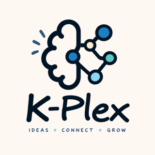
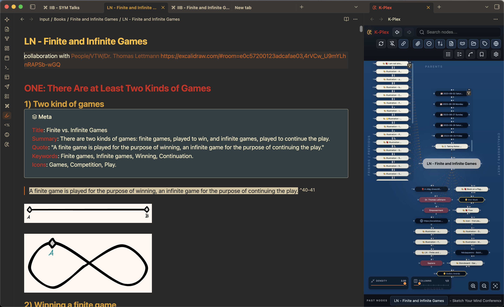
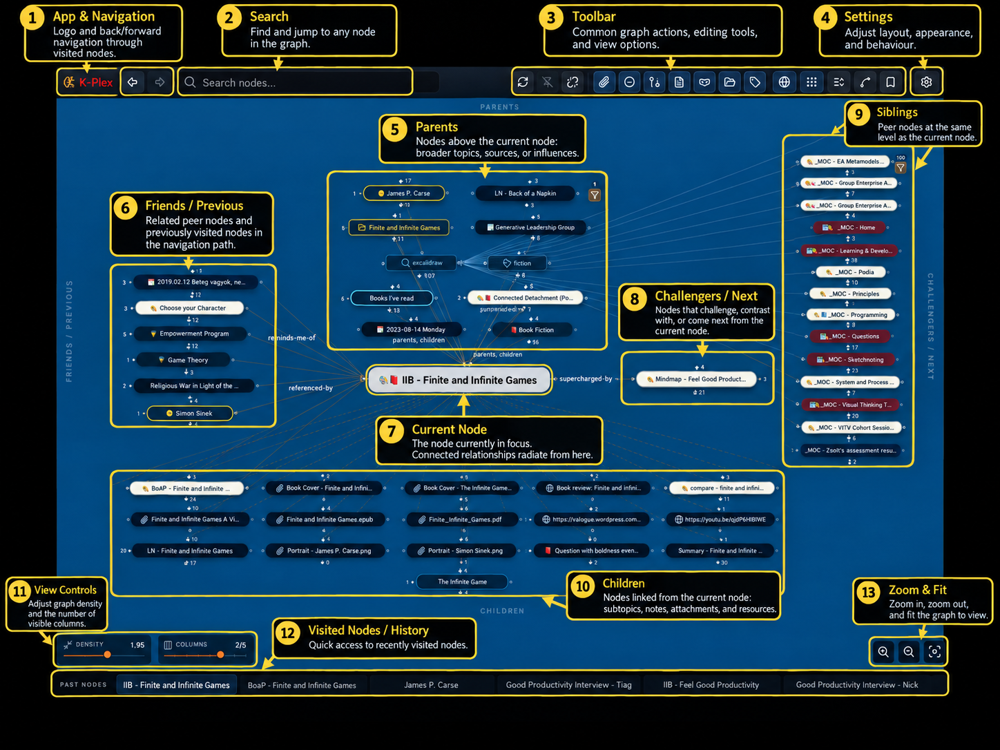
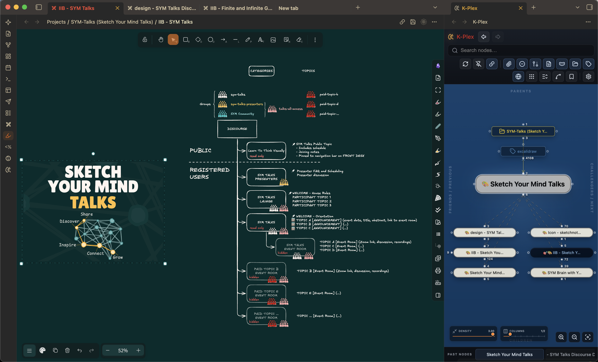

# K-Plex

> On the very first startup on a device expect to see a longer indexing period. Once the index is created K-Plex will start in 1-2 seconds. The index is cached on the device locally, so if you restart Obsidian, the index does not need to be rebuilt from scratch.



**K-Plex (Knowledge Plex)** is a spatial knowledge navigator for Obsidian. It keeps one note at the center and places related notes in predictable directions, so position carries meaning instead of constantly changing like a force-directed graph.

K-Plex is inspired by the navigation model of TheBrain and is the successor to ExcaliBrain. It preserves the relationship-oriented way of thinking that made ExcaliBrain useful, while providing its own interface and indexing system. **Excalidraw and Dataview are not required.**

K-Plex is designed for people who want to *move through* their notes rather than stare at an entire vault at once: follow a parent, compare challengers, see siblings, open a related document beside the graph, expand a note into sections, or temporarily reshape the Plex with Graph Lenses.

> Warning: K-Plex is a new plugin and is still undergoing real-world testing. Bugs and unexpected behavior are possible. Before using K-Plex to create or modify relationships between important notes, I strongly recommend trying it first on a small set of test notes. As with any plugin that can modify your vault, keep a current backup of your data.



## Why K-Plex?

Large graph views can quickly become dense and hard to navigate. K-Plex takes a different approach: it shows a **structured Plex around the current note** and keeps relationship directions stable.

That makes the graph useful as a working surface:

| Relationship | Position |
| --- | --- |
| Parents | above |
| Children | below |
| Friends / Previous | left |
| Challengers / Next | right |
| Siblings | separate peripheral area |

The same relationship keeps the same spatial meaning as you move from note to note. You can therefore build a mental map of your knowledge without depending on a force simulation.

## Requirements

- Obsidian **1.13.0 or newer**
- Desktop, tablet or mobile
- Desktop if you want to use Obsidian pop-out windows

K-Plex can coexist with classic ExcaliBrain because it uses its own plugin ID.



## Getting started

1. Install and enable K-Plex.
2. Open it from the ribbon or run **Open K-Plex** from the Command Palette.
3. Allow the first index to complete. On later starts K-Plex restores its cached index and becomes usable much faster.
4. Click a note in the Plex to make it the new center.
5. Use the four relationship areas around the center to explore or build your knowledge structure.

Useful commands include:

- **Open K-Plex**
- **Focus active note in K-Plex**
- **Open K-Plex in side panel**
- **Open K-Plex in pop-out window** (desktop)
- **Rebuild K-Plex index**
- **Add parent / child / friend / challenger**

On phones, K-Plex opens naturally in the side panel. Tablets can use either a normal K-Plex tab or the side panel.

## Navigating the Plex

- **Single-click / tap** a node to make it the center.
- **Double-click** a file-backed node to open it in Obsidian.
- Double-clicking a URL opens it in the browser.
- Double-clicking an unresolved link can create the missing Markdown note.
- Folder and tag nodes can also become the center.
- Drag empty graph space to pan and use the mouse wheel or pinch gesture to zoom.
- Long-press on touch devices opens the same context menus available with right-click on desktop.
- Clicking or touching empty graph space clears temporary node, gate and connector highlights.
- Use **Fit graph** whenever you want to bring the visible Plex back into view.

K-Plex uses positional animation when navigating: notes that exist in both scenes visibly move to their new location, while new notes enter from the direction of their relationship. Animation speed can be changed in **Settings → K-Plex → Graph**, including turning it off completely.

### Search, history and pins

The search box finds notes by title, alias and path using fuzzy matching. Exact and prefix matches rank above looser matches.

Keyboard shortcuts while K-Plex has focus:

- **Up / Down** — move through search results
- **Enter** — activate the selected result
- **Escape** — close the result list
- **F4** or **Ctrl/Cmd+F** — focus search

K-Plex also keeps a **Past nodes** history for back/forward navigation. Pins are separate from history and are useful for keeping a small number of important nodes available as stable shortcuts.

## Creating and editing relationships

K-Plex lets you create Parent, Child, Friend and Challenger relationships directly from the Plex. You can start from a gate, use the Command Palette, or use node/connector context menus.

The relationship dialog provides:

- fuzzy search for existing notes;
- fuzzy search for ontology fields;
- creation of new Markdown notes;
- optional Excalidraw note creation when Excalidraw is installed;
- remembered ontology choices for each relationship type;
- remembered Markdown/Excalidraw create action, including Ctrl/Cmd+Enter;
- filename validation and duplicate-name checking;
- an **Open for editing** toggle for new notes.

Newly created notes and their relationships appear in the Plex immediately instead of waiting for Obsidian's background indexing cycle. If **Open for editing** is enabled, the new note becomes the center and opens in the companion Sidecar in Obsidian's normal Markdown editor, ready for writing.

You can also drag an existing related node to another relationship area to reclassify it. K-Plex updates the graph immediately while the underlying note change is written. When K-Plex needs to create a new YAML/document property for a relationship, it adds that property at the bottom of the property list.

### Connection details and unlinking

A visible connection may come from YAML properties, body fields, ordinary links, folder/tag structure, URLs, dates, or other supported sources. A single connection can also be supported by several different source occurrences.

Right-click a connector to access two related workflows:

- **Connection details…** explains why K-Plex resolved the relationship the way it did, shows the active ontology, deduplicates repeated evidence that points to the same physical source location, and lets you jump to each exact source occurrence. You can add another ontology without rewriting or removing existing body/property sources; for an inferred relationship, **Specify ontology…** adds its first explicit ontology.
- **Unlink connection** removes a single unambiguous editable property source directly. If several sources contribute to the edge, K-Plex opens Connection details rather than guessing which source you intended to remove.

**Go to source** opens the real Markdown note at the relevant location, using the Sidecar when it is available. Continue editing there with Obsidian's normal editor, wikilinks, suggestions and hotkeys. The source Markdown files remain the source of truth; K-Plex does not create a separate database of edge notes.

## Quick Filter and Graph Lenses

K-Plex offers two levels of filtering.

### Quick Filter

Use the funnel button for fast, temporary filtering by:

- keyword;
- tag;
- note type.

Keyword matching includes title, path, alias and relationship definition.

### Graph Lenses

**Graph Lenses** are reusable filters and styling rules for the Plex. They work only on the currently visible K-Plex neighborhood; they do not turn K-Plex into an arbitrary whole-vault graph query tool.

A lens can match three kinds of things:

- **Notes** — for example tags, note properties, paths or note types.
- **Relationships** — for example Parent/Child/Friend/Challenger roles or a custom relationship property such as `working-on`.
- **Relationship evidence** — the specific source that caused a relationship to exist, such as a particular property field.

A lens can then:

- **Show matching** items;
- **Hide matching** items;
- **Style matching** notes or connectors without hiding anything.

The default lens editor is a visual builder inspired by Obsidian Bases: choose a field, operator and value rather than writing query syntax. Relevant values are suggested where possible.

For example, to show only connections created with a `working-on` relationship property:

**Relationship → Show matching → Relationship property → is → working-on**

Saved lenses have an eye control, so you can turn them on and off without deleting them. Multiple lenses can be active together.

### Keep layout or Reflow

At the top of the filter panel you can choose how filtered results are displayed:

- **Keep layout** — hide nonmatching elements but leave surviving nodes in their original positions.
- **Reflow** — lay out the surviving relationships as though they were the only items in the Plex.

Keep layout is useful when you want to preserve spatial context. Reflow is useful when a large Plex is reduced to a small focused subset.

When a visibility filter is active, gate counts can show **shown/total**, such as `2/12`, so you can still see that hidden relationships exist.

### Styling with lenses

Style lenses use the same matching rules as filters. Depending on scope, they can change node fill/border/text appearance or connector color, width, line style and label presentation.

This makes it possible to create temporary visual perspectives without changing your notes. For example, you might highlight all `working-on` relationships, dim a category of notes, or emphasize relationships backed by a specific ontology field.

For a detailed walkthrough, see [Graph Lenses](docs/GRAPH_LENSES.md).

## Expand a Markdown note into sections

A Markdown note can be expanded from the center into its heading hierarchy. This gives you a temporary document outline directly inside the Plex without permanently adding headings to the vault graph.

- Heading levels become a foldable tree.
- Relationships found inside a section attach to that section.
- YAML/frontmatter and content before the first heading stay attached to the central note.
- Folded sections project hidden descendant relationships onto the nearest visible section while retaining their original source for explanation.
- Double-click / tap a section to open the source note at that heading.
- Use **Fold all sections** and **Unfold all sections** for larger documents.

This is useful when a single long Markdown file contains several ideas or relationship-rich sections that you want to explore without permanently splitting the document into separate notes.

## Expanded relationship view

Expanded view can show children beneath visible first-level nodes, giving you one additional layer of context without turning the Plex into an arbitrary-depth graph.

Expanded children are intentionally smaller and more subdued. Larger child groups scroll locally so the overall Plex remains readable.

## Companion sidecar

K-Plex can keep a normal Obsidian note pane beside the graph as a **companion sidecar**.

The sidecar:

- can be placed left, right, above or below K-Plex;
- follows the current K-Plex center;
- uses normal Obsidian Markdown reading/editing views;
- supports plugin-owned file views such as Excalidraw;
- can be folded so the document temporarily gets more space;
- can be detached and turned back into an ordinary independent Obsidian pane.

The small **Sidecar control lives on the corresponding edge of K-Plex**. If you close the Sidecar, the control stays on that edge so you always know where to reopen it. K-Plex remembers the last Sidecar position; if you have never positioned it before, the configured default side is used.

Closing K-Plex does not close the document you were reading.

### Note-tab synchronization

K-Plex can be:

- independent from note tabs;
- linked to the most recently used note tab;
- pinned to one fixed note tab.

There are also one-shot actions to send the current K-Plex note to the most recent note tab, or bring the most recent note tab into K-Plex.

## Layout and appearance

K-Plex gives the major relationship regions their own space limits, so large Parents, Children, Friends, Challengers and Siblings areas can scroll independently instead of stretching the entire graph.

You can configure:

- parent and child column counts;
- separate height limits for the main relationship regions;
- maximum nodes per zone;
- density/compactness;
- straight or curved connectors;
- arrowheads and relationship labels;
- animation speed;
- visibility of attachments, folders, tags, URLs, unresolved links, inferred relationships and other node types;
- Note type styling.

Desktop, tablet, mobile, sidepanel and pop-out views can keep different density/column profiles, so a compact mobile layout does not have to change your desktop arrangement.

### Images in nodes

K-Plex can use a note property or Dataview-style inline field to give a node a visual thumbnail. The default fields are:

```markdown
thumbnail:: [[image.jpg]]
node-image:: [[image.jpg]]
```

- **thumbnail** shows a small image before the normal node label.
- **node-image** replaces the visible label with a compact image while keeping the node's normal graph footprint and accessible file identity.

Images stay deliberately small so they do not make the Plex expand. On desktop, hover the image for a larger preview. The property names can be changed in **Settings → K-Plex → Appearance → Node images**.

An image referenced only through the thumbnail/node-image fields is treated as presentation metadata, so it is not also shown as an inferred child. If the same image is linked independently through normal content or another ontology, it remains a normal graph node as well.

Image attachments such as JPG, PNG, GIF, WebP and SVG files can also be shown directly as nodes. Choose whether attachment nodes display **file name**, **thumbnail + file name** (default), or **image only** in the same settings section.

### Note type styling

A Markdown property can define a note's visual type. By default this property is **Note type**.

In **Settings → K-Plex → Appearance** you can assign styles to individual Note type values, including icon, background, text, border and font size.

Graph Lenses complement Note type styles when you want temporary, context-specific styling rather than a permanent visual identity.

## Mobile and touch

K-Plex has explicit touch interaction rather than relying on desktop mouse events translated by the browser.

- one-finger pan;
- two-finger pinch zoom;
- tap navigation;
- long-press context menus;
- touch-safe relationship dragging.

Phone and tablet layouts can use their own density and column settings.

## Large vaults and startup behavior

K-Plex is designed to remain practical on large real-world vaults.

After the first index has been created, K-Plex restores cached graph information on later starts so you can usually begin working quickly. The current neighborhood is prioritized first and the rest can continue loading in the background.

While you work, changes are handled incrementally: editing one note does not normally require K-Plex to rebuild the entire vault. Background updates also preserve your current camera and scroll position rather than repeatedly recentering the graph.

Version 0.0.3 substantially improved startup performance, incremental updates, large-vault behavior, iPad stability, mobile/touch interaction, graph animation, relationship editing, section expansion, provenance/explanation, sidecar behavior and search/navigation. These improvements form the foundation for the newer Graph Lens workflow.

If graph data ever appears stale, use the toolbar refresh button or run **Rebuild K-Plex index**.

## Ontology and ExcaliBrain compatibility

K-Plex understands configurable relationship field names for:

- Parent
- Child
- Friend / Jump
- Challenger
- Previous
- Next
- Hidden

It supports YAML/frontmatter relationships and compatible Dataview-style body fields without requiring the Dataview plugin.

If classic ExcaliBrain is installed and running, K-Plex can import compatible settings. You can also use **Import ExcaliBrain settings** manually from **Settings → K-Plex → Compatibility**.

K-Plex and classic ExcaliBrain can coexist while you migrate.

## Settings

K-Plex settings are organized into:

1. **Graph** — navigation, layout, visibility, animation and connector behavior
2. **Ontology** — relationship field names and ontology helpers
3. **Appearance** — graph, gate and Note type styling
4. **Sidecar** — companion-pane behavior and Markdown mode
5. **Compatibility** — ExcaliBrain import and legacy settings

## Help, issues and contributing

If you find a bug, have a feature request, or want to suggest an improvement, please use the K-Plex GitHub repository:

- **Repository:** https://github.com/zsviczian/kplex
- **Issues:** https://github.com/zsviczian/kplex/issues

Contributions are welcome, including bug fixes, documentation improvements, testing and code contributions. See [CONTRIBUTING.md](CONTRIBUTING.md) before preparing a pull request.

Community discussion and announcements are also available through the [Sketch Your Mind Community](https://community.sketch-your-mind.com).

## Support development

K-Plex is developed independently. If it is useful to you and you would like to support continued development, you can do so here:

**[Support K-Plex on Ko-fi](https://ko-fi.com/zsolt)**
